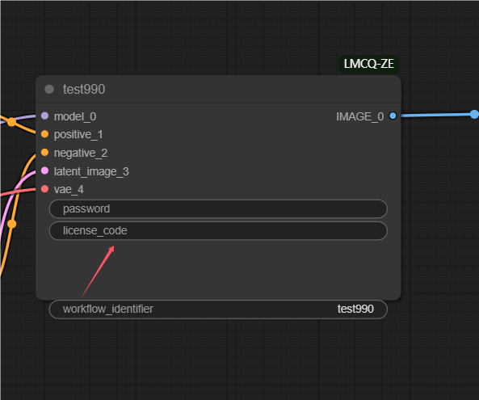
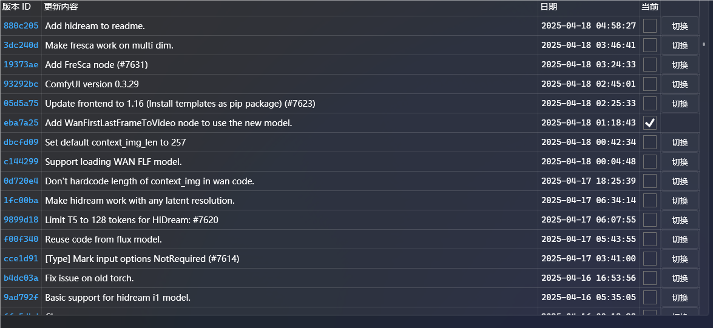
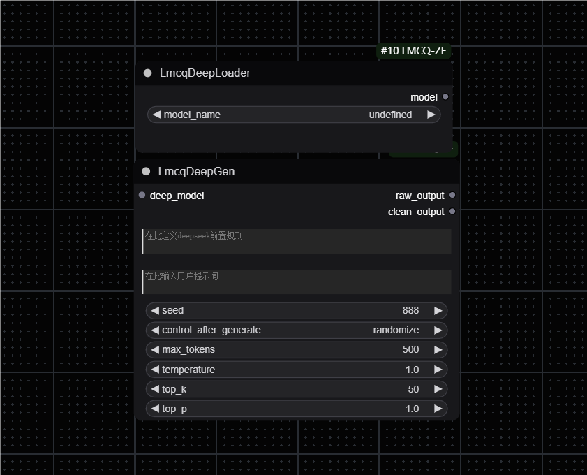
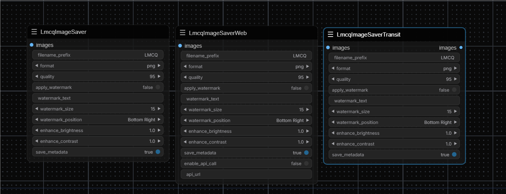
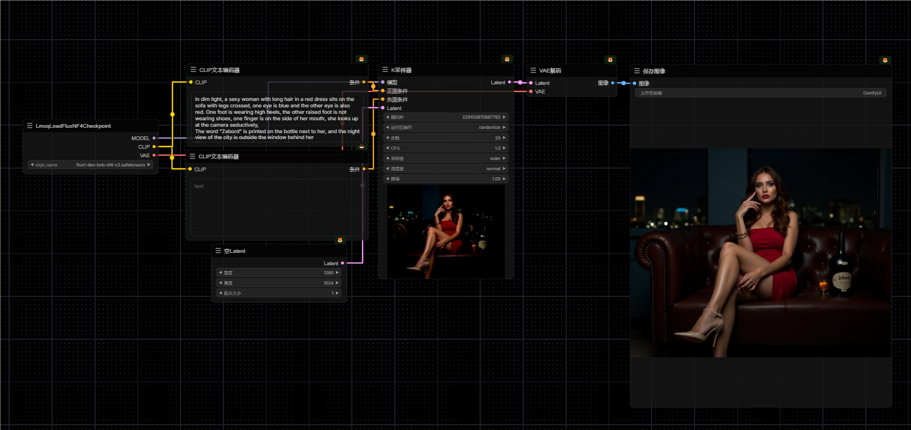
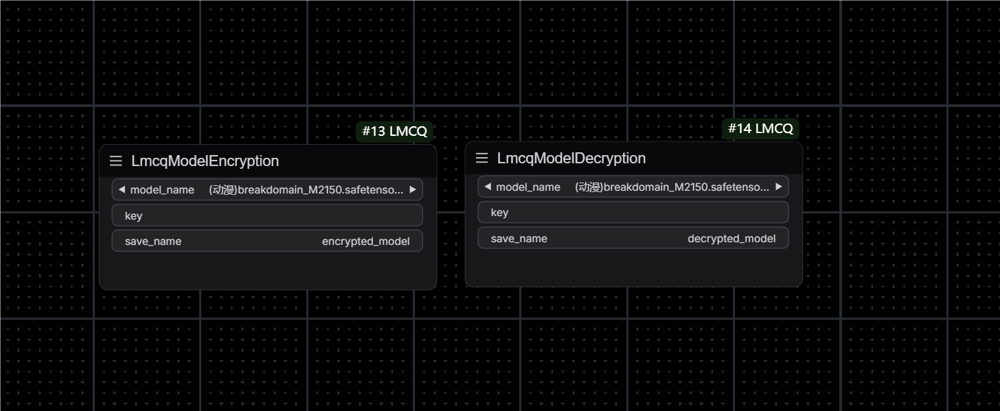
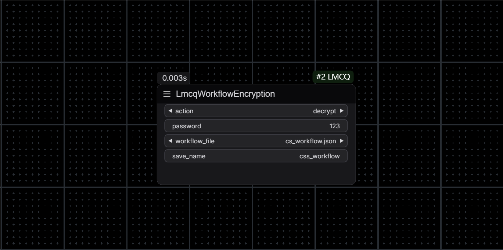
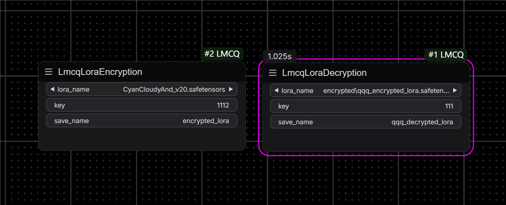
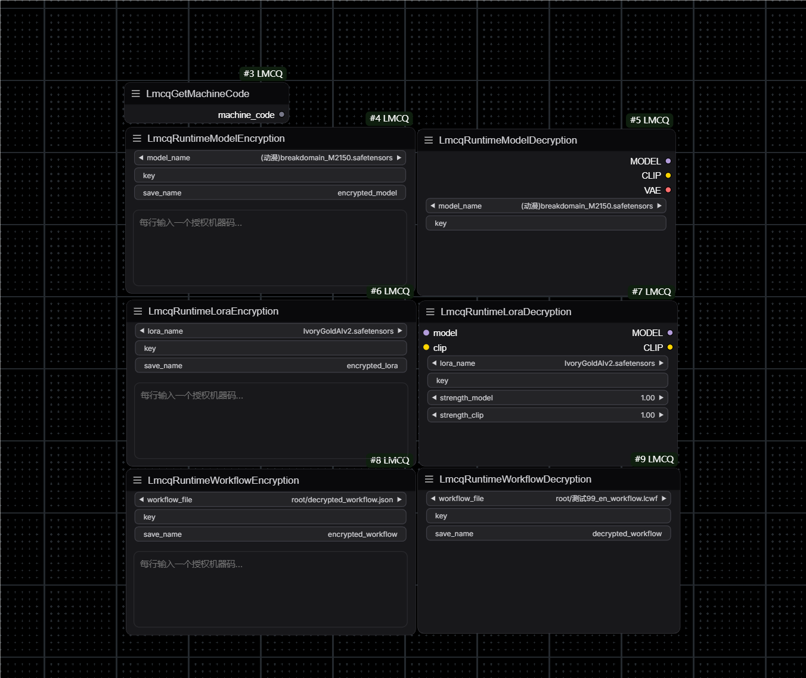

# ComfyUI-LMCQ
**Read this in other languages: [中文](README_CN.md).**

## Update Log July 29, 2025 (Authorization Code System & Configurable API Endpoints!)

We are excited to announce two significant updates that enhance both usability and flexibility:

### 🔑 New Authorization Code System


### Cloud service platform access address: https://modelkey.cn

**What's New:**
- ✓ Cloud-based authorization code generation for encrypted models and workflows
- ✓ One-click distribution of authorization codes to users
- ✓ Automatic machine binding on first verification
- ✓ No more manual machine code exchanges!

**How It Works:**
1. **For Creators:**
   - Generate authorization codes in the cloud platform for your encrypted models/workflows
   - Share these codes with your authorized users
   - No need to manually collect and bind machine codes anymore!

2. **For Users:**
   - Simply enter the authorization code in the `license_code` field of any decryption node
   - On first verification, your machine is automatically bound to that model/workflow
   - Access all authorized content immediately without sending machine codes to creators

**Supported Nodes:**
- All encrypted model decryption nodes (`LmcqAuthModelDecryption`)
- All encrypted LoRA decryption nodes (`LmcqAuthLoraDecryption`)
- All encrypted workflow nodes (`LmcqAuthWorkflowDecryption`)
- All encrypted group nodes (`LmcqGroupNodes`)

**Benefits:**
- 📱 **Simplified Authorization**: No more complex machine code exchanges
- 🔄 **Self-Service Binding**: Users can self-authorize with valid codes
- 🛡️ **Enhanced Security**: Each code can have usage limitations and expiration dates
- ⏱️ **Time-Saving**: Instantly distribute authorization to multiple users

### 🌐 Configurable API Endpoints

**New Feature:**
- ✓ Configurable API endpoint URLs in `auth_key.json`
- ✓ Support for private cloud deployments
- ✓ Default fallback to public servers if not configured

**How to Configure:**
Simply add a `base_url` parameter in your `auth_key.json` file:
```json
{
    "auth_key": "YOUR_AUTH_KEY",
    "auth_secret": "YOUR_AUTH_SECRET",
    "base_url": "http://your.custom.server:port/api/v1"
}
```

**Benefits:**
- 🏢 **Private Deployments**: Deploy your own authorization server for enhanced control
- 🔒 **Enhanced Privacy**: Keep all authorization traffic within your own network
- 🌍 **Global Flexibility**: Configure regional servers for improved performance
- 🔄 **Seamless Fallback**: If no custom URL is provided, the system automatically uses the default public server

This update dramatically improves the user experience for both content creators and end-users by eliminating the cumbersome process of manually exchanging machine codes, while also providing the flexibility to use custom authorization servers!

---

## Introduction

ComfyUI small node toolkit, this toolkit is mainly to update some practical small nodes, to make a contribution to the comfyui ecosystem,
PS: "LMCQ" is the abbreviation of the team name

## Update Log June 1, 2025 (Fixed the Wire Disconnection Issue After Encryption!)

This update solves the two most reported problems from users: lost connections after encryption and infinite loop errors!

### 🔧 Fixed Wire Disconnection After Encryption(Only for versions before eba7a25, input port will be lost after that, and manual connection is still required)

Users used to frequently encounter these problems:
- Selected several nodes for encryption, only to find all wires disconnected after encryption
- Had to manually reconnect all the wires, which was very troublesome  
- Sometimes incorrect connections caused workflows to fail

**Now it's completely fixed!** All connections are automatically maintained after encryption, no manual reconnection needed.

### 🛡️ Smart Detection to Avoid Infinite Loop Errors
Previously, when users selected nodes for encryption, they might accidentally create infinite loops, causing:
- "Loop Detected" errors during execution
- Workflows getting stuck and unable to run
- Not knowing what went wrong

**Now the system automatically detects this!** For example:
- You select "CLIP Text Encoder" and "K Sampler" to encrypt together
- But there's a "ControlNet" node in between that wasn't selected
- The system will warn you: "❌ Would create infinite loop, please encrypt separately"

### 📝 Simple Solutions
When the system warns of a problem, you can:
1. **Encrypt Separately**: Encrypt "CLIP Text Encoder" and "K Sampler" individually
2. **Select All**: Choose "CLIP Text Encoder", "ControlNet", and "K Sampler" together for encryption
3. **Reselect**: Choose other node combinations that won't cause problems

### 🔐 New Password Persistence Feature
This is the long-awaited feature! Now you don't have to worry about re-entering passwords after browser refresh:

- **🔄 Auto Save & Restore**: Passwords are automatically saved to browser's local storage when entered in encryption nodes
- **🌐 Refresh-Proof**: After browser refresh, all created encryption nodes will automatically restore their previously entered passwords
- **🛡️ Security Protection**: Passwords are only saved locally in browser, not written to workflow files, ensuring no password leakage when sharing workflows
- **🧹 Smart Cleanup**: Passwords are automatically cleaned when nodes are deleted; system periodically cleans invalid password data
- **🛠️ Manual Cleanup**: If you need to clear all passwords, enter `window.clearLmcqPasswords()` in browser console

### 🎉 Much Easier to Use Now
- Right-click menu directly shows whether encryption is possible, no need to worry about wrong selections
- If there's a problem with your selection, the menu will be grayed out with a reason
- No more wire disconnection or infinite loop issues after encryption
- **Enter password once, remember forever!** No need to repeatedly enter passwords for multiple encryption nodes in complex workflows

In short, the encrypted node group feature is now more stable and user-friendly!

---

## Update Log May 8, 2025 (Encrypted Node Groups & Enhanced Security Core!)

We are excited to announce two major advancements in ComfyUI-LMCQ, focusing on enhanced functionality and core security:

### 1. Encrypted Node Group Functionality (Cloud Secured)

Introducing the **LmcqGroupNode**! This powerful new node allows you to encapsulate a group of nodes (a subgraph) into a single, securely encrypted unit, managed via our cloud platform.

 <!-- TODO: Add a relevant screenshot for group node functionality -->

**Key Features**:
- **Protect Complex Workflows**: Securely package intricate node combinations or proprietary logic into a single, encrypted block.
- **Cloud-Based Security**: Encryption keys and authorizations are managed through our secure cloud API, ensuring only verified users can access the internal subgraph.
- **User-Friendly Operation**: Once authorized, the encrypted group functions like a standard ComfyUI node group, with its internal complexity remaining protected.
- **Secure Access**: Utilizes a user-defined `workflow_identifier` and `password` for authentication with the cloud service to enable decryption.
- **Optional Machine Binding**: For an added layer of security, node groups can be bound to specific machine codes, aligning with the protection offered by other Lmcq authenticated nodes.

**How It Works (Conceptual)**:
1. A subgraph designed in ComfyUI is prepared for encryption.
2. This subgraph, along with a chosen password, a unique identifier, and optional machine codes, is registered with the Lmcq cloud service.
3. The service provides an encrypted representation of the subgraph.
4. In ComfyUI, the `LmcqGroupNode` uses this encrypted data, the identifier, and password to request decryption from the cloud service upon execution.
5. If successfully authenticated and authorized, the subgraph is decrypted in memory and functions as intended.

This feature empowers creators to share advanced functionalities or pre-configured setups with enhanced control and security, preventing direct exposure of the internal workflow logic.

### 2. Enhanced Core Security through Advanced Compilation

ComfyUI-LMCQ's core runtime modules now benefit from a significant security upgrade. We have transitioned to an **advanced compilation technique** that transforms our Python source code into a more secure, binary format.

**Key Improvements**:
- **Greatly Increased Source Code Protection**: The new compiled format is substantially more resistant to reverse-engineering and decompilation compared to previous protection methods. This robustly safeguards the intellectual property embedded in our core logic.
- **Enhanced Plugin Integrity**: This security enhancement contributes to a more secure and trustworthy plugin for all users.
- **Optimized Distribution**: The distributable version of the plugin now includes these securely compiled modules, ensuring that the protected code is what end-users receive.

This fundamental improvement in how we protect our codebase ensures that ComfyUI-LMCQ continues to offer innovative features with a strong emphasis on security and intellectual property protection. End-users will experience these benefits through a more secure plugin environment.

## Update Log 2025-04-23 (Code Protection Node!)

Introducing the new Code Protection nodes designed to encrypt your Python source code files for ComfyUI custom nodes:

 <!-- Placeholder: Add screenshot later -->

### Code Protection Nodes
- **LmcqCodeEncryption**: Encrypts a `.py` file, generating a `.pye` encrypted file and an optional loader stub (`.py`).
- **LmcqCodeDecryptionLoader**: Loads and executes the encrypted `.pye` file using the loader stub.

### Key Features
- **Protect Your Logic**: Encrypt your custom node's source code to prevent easy reverse engineering or unauthorized modification.
- **Encryption Levels**: Choose between "Basic", "Advanced", and "Supreme" encryption levels for varying degrees of security.
- **Optional Obfuscation**: Apply simple variable name obfuscation for an extra layer of protection (Note: May impact complex code, use with caution).
- **Custom Import Hook**: Generates a loader stub (`.py` file with the original name) that automatically handles the decryption and loading process when the module is imported.
- **Keep Original Option**: Decide whether to keep the original `.py` file after encryption.

### How It Works
1. Use `LmcqCodeEncryption` to select your `.py` file, choose an encryption level, and optionally enable obfuscation and loader stub generation.
2. The node outputs an encrypted `.pye` file and potentially overwrites the original `.py` with a loader stub (if `add_custom_import_hook` is True and `keep_original` is False).
3. When Python imports the loader stub `.py` file, it automatically finds the corresponding `.pye` file, decrypts it using the embedded key, and executes the code in memory.

This system allows you to distribute your custom nodes in a protected format while maintaining ease of use for end-users.

## Update Log 2025-03-04 (Authentication Server Encryption System!)

We have launched a new authentication server encryption system that provides stronger and more flexible protection mechanisms for model creators:

### Authentication Server Encryption System
- ✓ HTTP-based Authentication Server Verification
- ✓ Dynamic Key Distribution Mechanism
- ✓ Real-time Authorization Validation
- ✓ Online Management Platform

### Key Features
1. **Model Usage Management**
   - Dynamically adjust authorized machine codes
   - Flexible model usage period settings
   - Customizable usage count limits
   - Real-time usage statistics

2. **Online Management Platform**
   - URL: http://1.95.3.202/
   - One-click management of all encrypted models
   - Real-time model usage monitoring
   - Quick authorization updates

3. **Supported Model Types**
   - Checkpoint Model Encryption (LmcqAuthModelEncryption/LmcqAuthModelDecryption)
   - LoRA Model Encryption (LmcqAuthLoraEncryption/LmcqAuthLoraDecryption)
   - Workflow Encryption (LmcqAuthWorkflowEncryption/LmcqAuthWorkflowDecryption)
   - Flux Model Encryption (LmcqAuthFluxEncryption/LmcqAuthFluxDecryption)

4. **Security Features**
   - Real-time Machine Code Validation
   - Timestamp Anti-replay Protection
   - Encrypted Communication Protection

### Usage Process
1. Register an account on the authentication server
2. Obtain creator key (auth_key) and key secret (auth_secret)
3. Configure key information in auth_key.json
4. Use corresponding encryption nodes for model encryption
5. Log in to the management platform for permission management

### Important Notes
- Keep the key information in auth_key.json secure
- Regularly change keys to enhance security
- Update authorization information through the management platform promptly

## Update Log 2025-02-10 (DeepSeek model integration!)

### Deepseek series nodes
 <!-- You need to add a screenshot and replace the actual file name -->

#### LmcqDeepLoader
~~~text
Function details:
model_name: Select the locally downloaded Deepseek large language model (the default model is read in the /models/deepseek/ directory)
~~~
Model download address:
1B model: https://huggingface.co/deepseek-ai/DeepSeek-R1-Distill-Qwen-1B/tree/main
7B model: https://huggingface.co/deepseek-ai/DeepSeek-R1-Distill-Qwen-7B/tree/main
14B model: https://huggingface.co/deepseek-ai/DeepSeek-R1-Distill-Qwen-14B/tree/main
32B model: https://huggingface.co/deepseek-ai/DeepSeek-R1-Distill-Qwen-32B/tree/main
70B model: https://huggingface.co/deepseek-ai/DeepSeek-R1-Distill-Llama-70B/tree/main

Please download all the corresponding files for each model, use its name as the folder name, put all the files into the folder, and put it in the /models/deepseek/ directory: such as /models/deepseek/DeepSeek-R1-Distill-Qwen-7B/

#### LmcqDeepGen
~~~text
Function details:
system_prompt: system-level command setting (define model behavior rules)
user_prompt: user input prompt words

seed: random seed (0-9999999)
max_tokens: maximum number of generated tokens (0-unlimited)
temperature: Generation temperature (0-2, the higher the value, the more random)
top_k: Number of candidate words (0-100)
top_p: Core sampling probability (0-1)

Output port:
raw_output: Raw output including the thinking process
clean_output: Clean output after cleaning
~~~

Feature description:
1. Support setting model behavior rules through system_prompt
2. Automatically clean the <think>thinking process</think> tag of the model output
3. Provide dual output ports to meet the needs of different scenarios
4. Fully support Deepseek model parameter system
~~~

## Update Log 2025-01-08 (White-box Encryption & Enhanced Security!)

We have implemented a sophisticated white-box encryption system and enhanced our security mechanisms:

### White-box Encryption
- Dynamic T-box and S-box generation
- Complex key expansion algorithm
- Multiple round transformations
- Memory protection mechanism

### Enhanced Security Features
- ✓ Secure key storage
- ✓ Anti-debugging protection
- ✓ Memory tampering detection
- ✓ Runtime integrity verification

The new white-box encryption implementation makes it extremely difficult to extract encryption keys even with full access to the code. Combined with our existing multi-layer protection scheme, this provides state-of-the-art security for your models and workflows.

## Update log 2024-12-29 (Introducing a multi-layer protection mechanism in the core code of the runtime protection system package!)
Because the encryption and decryption node code of the previous version was displayed in plain text, it was easy for reverse engineers to crack it, thus failing to ensure the security of the model. Now the core encryption and decryption code uniformly introduces a multi-layer protection mechanism

- Multi-layer protection scheme
   - AST-level code obfuscation
   - PyArmor basic encryption
   - Variable name/function name obfuscation
   - Interference code injection
   - String obfuscation

Now all the security node codes in the project are highly encrypted with a multi-layer protection scheme, which greatly increases the difficulty of cracking by reverse engineers, thereby ensuring the security of the model.

## image

1. LmcqImageSaver: mainly provides watermarks and metadata information for the generated image files

2. LmcqImageSaverTransit: There is not much difference in function from LmcqImageSaver, the only difference is that the processed image files can be sent to the next node

3. LmcqImageSaverWeb: Add active sending of files and prompt_id to the specified interface address based on LmcqImageSaver (the purpose of its design is to avoid WS to maintain a large number of long connection requests)



~~~
Function details

filename_prefix:        File name prefix
format:                 File format, currently supports 'png, jpg, webp'
quality:                File compression rate, the smaller the value, the higher the compression rate, the smaller the corresponding file size, if you want to use this function, please select jpg format in the file format
apply_watermark:        Whether to enable the watermark function
watermark_text:         Watermark text content
watermark_size:         Watermark size, default 15, maximum 70
watermark_position:     The position of the watermark in the image
enhance_brightness:     Set the brightness of the image, the lower the value, the darker the image
enhance_contrast:       Set the color saturation of the image, the lower the value, the lower the saturation
save_metadata:          Whether to save the workflow information behind the image
enable_api_call:        Whether to enable the interface request, if enabled, the prompt_id in the file and api will be sent to the corresponding interface after the workflow is completed
api_url:                The requested interface address

~~~
## flux

1. Since lllyasviel updated the NF4 version of flux, but there is no corresponding node in comfyui to load its model, the conventional checkpointLoader cannot adapt to the model, so this node is designed to facilitate the use of the model, and the usage is the same as the conventional checkpointLoader



## Update log 2024-08-20

Image series features added
~~~
watermark_type: watermark type, default text, options: text, image

watermark_image: connect the image you want to use as a watermark

watermark_opacity: watermark transparency, default 0.5, maximum value 1
~~~

## Update log 2024-11-11

### Utils

1. LmcqInputValidator: Used to validate input value types, can determine whether the input is a pure number or a string

~~~
Function details

input_text:     Input text to be validated
check_type:     Validation type, options:
               - is_digit: Check if it's a pure number
               - is_string: Check if it's a string (any input that's not a pure number is considered a string)
~~~


## Update log 2024-12-12 (Model encryption!!!)

### Model encryption and decryption

### LmcqModelEncryption
~~~
Function explanation

model_name: Select the model you want to encrypt
key       : Encryption key (custom, key password for subsequent decryption)
save_name : Encrypted model name
~~~
After filling in, click Execute. Two files will be generated in your model folder, a model and a file with the suffix .meta. The meta file records your encryption signature and version information. Remember to put the two files in the same directory, otherwise the encrypted model cannot be decrypted

### LmcqModelDecryption
~~~
Function explanation

model_name: Select the model you want to decrypt
key       : Encryption key (enter the key information set during encryption)
save_name : Decrypted model name
~~~

## Update Log 2024-12-18 (Workflow Protection!)

### Workflow Encryption/Decryption


### LmcqWorkflowEncryption
~~~
Function Details:
action:        Choose to encrypt or decrypt workflow
password:      Password for encryption/decryption
workflow_file: Select the workflow file to process (from root or plugin workflows folder)
save_name:     Name for the saved file
~~~

This node allows you to encrypt your workflow files with a password, preventing unauthorized access. The encrypted workflow can only be loaded after decryption with the correct password.

Usage:
1. Save your workflow file to either:
   - ComfyUI root/workflows folder (shown as "root/filename")
   - Plugin's workflows folder (shown as "plugin/filename")
2. Use 'encrypt' action to create an encrypted version
3. Share the encrypted workflow file
4. Recipients must use 'decrypt' action with the correct password to use the workflow

Note: The encrypted/decrypted file will be saved in the same folder as the source file.

## (LoRA Protection!)

### LoRA Model Encryption/Decryption


### LmcqLoraEncryption
~~~
Function Details:
lora_name:  Select the LoRA model to encrypt
key:        Encryption key (for later decryption)
save_name:  Name for the encrypted model
~~~
After execution, two files will be generated in your loras/encrypted folder: an encrypted model and a .meta file. The meta file contains encryption signature and version information. Both files must be kept together for successful decryption.

### LmcqLoraDecryption
~~~
Function Details:
lora_name:  Select the encrypted LoRA model
key:        Decryption key (must match encryption key)
save_name:  Name for the decrypted model
~~~
The decrypted LoRA will be saved in the loras/decrypted folder.

## Update Log 2024-12-21 (Runtime Protection System!)

### Machine Code & Runtime Protection


### LmcqGetMachineCode
A utility node that generates a unique machine code based on hardware and system information. This code is used for authorization in the runtime protection system.

### Runtime Model Protection
~~~
LmcqRuntimeModelEncryption:
- model_name:    Select the model to encrypt
- key:          Encryption key
- save_name:    Name for the encrypted model
- machine_codes: List of authorized machine codes (one per line)

LmcqRuntimeModelDecryption:
- model_name:    Select the encrypted model
- key:          Decryption key
~~~
Provides real-time model encryption/decryption with machine-specific authorization. Models can only be loaded on authorized machines.
PS: The encrypted model is loaded in memory, so the complete model will not be saved locally. It can only be used in the workflow to protect the complete model from being spread to the greatest extent (only LmcqRuntimeModelDecryption can be used to load the encrypted model, and the rest are invalid)

### Runtime LoRA Protection
~~~
LmcqRuntimeLoraEncryption:
- lora_name:     Select the LoRA to encrypt
- key:          Encryption key
- save_name:    Name for the encrypted LoRA
- machine_codes: List of authorized machine codes

LmcqRuntimeLoraDecryption:
- model:         Input model
- clip:         Input CLIP
- lora_name:    Select the encrypted LoRA
- key:          Decryption key
- strength_model: LoRA strength for model
- strength_clip:  LoRA strength for CLIP
~~~
Secure LoRA models with machine-specific authorization and real-time loading.
PS: The encrypted model is loaded in memory, so the complete model will not be saved locally. It can only be used in the workflow to protect the complete model from being spread to the greatest extent (only LmcqRuntimeLoraDecryption can be used to load the encrypted model, and the rest are invalid)
### Runtime Workflow Protection
~~~
LmcqRuntimeWorkflowEncryption:
- workflow_file: Select workflow to encrypt
- key:          Encryption key
- save_name:    Name for encrypted workflow (.lcwf)
- machine_codes: List of authorized machine codes

LmcqRuntimeWorkflowDecryption:
- workflow_file: Select encrypted workflow
- key:          Decryption key
- save_name:    Name for decrypted workflow
~~~
Protects workflows with machine-specific authorization. Encrypted workflows are saved in .lcwf format and can only be decrypted on authorized machines.

Note: The runtime protection system ensures that protected assets can only be used on specifically authorized machines, providing stronger security than password-only protection.

## 2024-12-29 TODO (next plan)

What we are preparing now:
Developing a complete authentication service system dedicated to more efficiently improving the functional security of ComfyUi security nodes. The core functional logic of all nodes will be provided by a third-party authentication service system to maximize the security of models and workflows (and provide more fancy gameplay such as: encryption model usage limit, encryption model usage time limit, encryption model usage device limit, etc.), providing creators with a safer creative environment, so stay tuned! ! !

## Contribute

zebord
